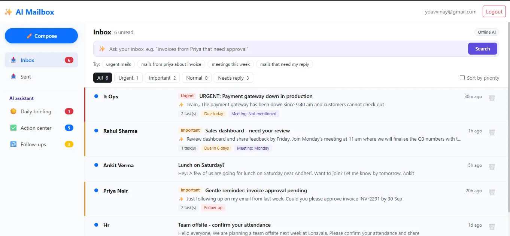
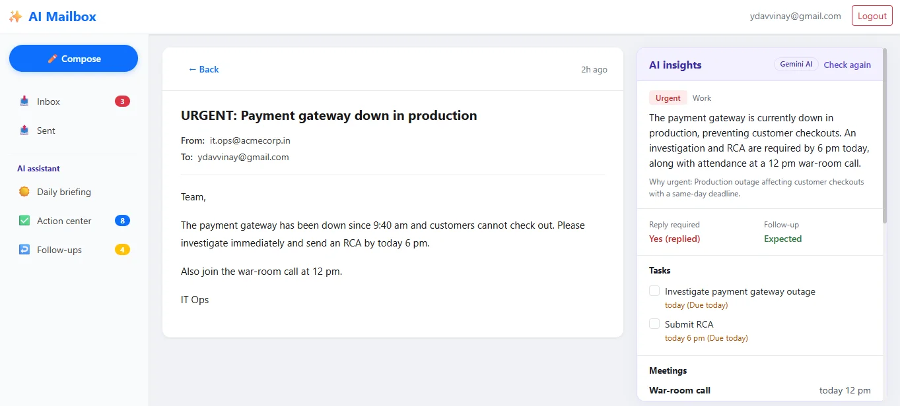
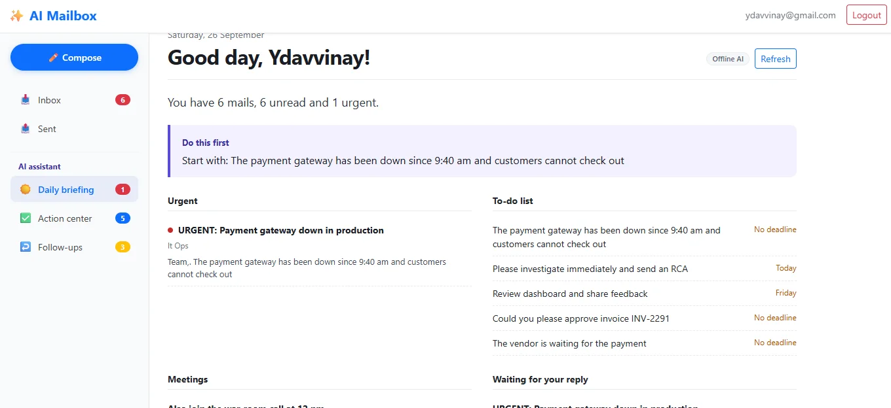
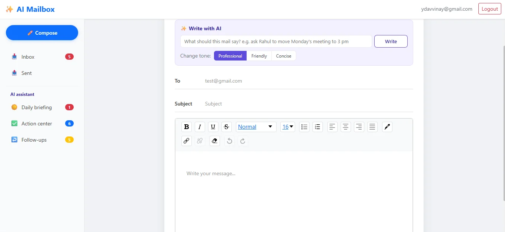

# AI Mailbox - Intelligent Email Management & Action Assistant

This is my AI Mailbox project made with React, Firebase and Gemini AI.
In this app user can send and receive mails, and AI reads every mail. It tells the priority, finds tasks, deadlines and meetings, and tells what to do next.

**Live Link:** https://ai-mailbox.vercel.app



## Example

Mail: "Review dashboard and share feedback by Friday. Join Monday's meeting."

AI shows:

- Action: Review dashboard and share feedback
- Deadline: Friday
- Meeting: Monday
- Reply Required: Yes
- Suggested Reply: written by AI

## Features

- Sign up and login using Firebase Authentication
- Send and receive mails between registered users
- Inbox updates live when new mail comes (Firestore)
- AI summary of every mail
- Priority for every mail: Urgent, Important or Normal
- AI finds tasks, deadlines and meetings from the mail
- AI writes a reply based on the mail
- Tone changer: Professional, Friendly or Concise
- Write a full mail from one line
- Follow-ups page shows mails where someone is waiting for reply
- Smart search in simple English, like "mails from priya about invoice"
- Daily briefing page with urgent mails, tasks, meetings and pending replies
- Action center with all tasks from all mails in one place
- If Gemini is not working, simple offline rules still work

## Tech Used

- React.js
- JavaScript
- Vite
- React Router
- React Bootstrap
- Context API and useReducer
- Firebase Authentication
- Firestore Database
- Draft.js (text editor)
- Gemini AI API
- Vercel (hosting and API)

## Screenshots

| Read Mail with AI | Daily Briefing |
|---|---|
|  |  |

| Compose with AI |
|---|
|  |

## What I Learned

- How to use AI in a real project, not just a chatbot
- How to write prompts so AI gives answer in JSON
- How to keep API key safe using a server file (`api/ai.js`)
- How to show live data from Firestore
- How to use Context API and useReducer for mails

## Problems I Faced

- Sometimes AI gave extra text with JSON. I removed it before reading the JSON.
- When AI free limit was over, app was not showing anything. I added simple offline rules so app still works.
- AI was checking the same mail again and again. I saved the AI result in Firestore so it runs only once.

## Future Plans

- Add attachments in mail
- Add calendar for meetings
- Add email notification for urgent mails

## How to Run

1. Clone the project

```bash
git clone https://github.com/VinayYadav07/ai-mailbox.git
cd ai-mailbox
```

2. Install packages

```bash
npm install
```

3. Make a `.env` file in the main folder and add your Firebase details and Gemini key

```
VITE_FIREBASE_API_KEY=your_api_key
VITE_FIREBASE_AUTH_DOMAIN=your_auth_domain
VITE_FIREBASE_DATABASE_URL=your_database_url
VITE_FIREBASE_PROJECT_ID=your_project_id
VITE_FIREBASE_STORAGE_BUCKET=your_storage_bucket
VITE_FIREBASE_MESSAGING_SENDER_ID=your_sender_id
VITE_FIREBASE_APP_ID=your_app_id
VITE_FIREBASE_MEASUREMENT_ID=your_measurement_id

GEMINI_API_KEY=your_gemini_key
AI_MODEL=gemini-3.1-flash-lite
```

4. Start the project

```bash
npm run dev
```

5. Open http://localhost:5173 in browser

## Made By

**Vinay Kumar Yadav**

- Portfolio: https://portfolio-rho-red-54.vercel.app
- LinkedIn: https://www.linkedin.com/in/vinay-yadav-593b53329
- GitHub: https://github.com/VinayYadav07
